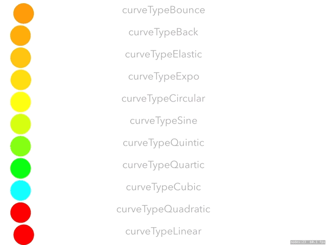

[](https://travis-ci.org/iosappdevelopmentwithswift@gmail.com/SpriteKitEasingSwift)
[](http://cocoapods.org/pods/SpriteKitEasingSwift)
[](http://cocoapods.org/pods/SpriteKitEasingSwift)
[](http://cocoapods.org/pods/SpriteKitEasingSwift)

This easing library began life as a port of <a href="https://github.com/buddingmonkey">buddingmonkey</a>'s Objective C <a href="https://github.com/buddingmonkey/SpriteKit-Easing">SpriteKit Easing library</a> to Swift.

This library extends upon the basic easing equations available in the SpriteKit framework by Apple.

Sprite Kit Easing makes available the following standard easing equations as SKActions.



Use SKEase methods to tween properties of an SKNode, such as:
* move
* scale
* scaleX
* scaleY
* rotate
* fade
* tweenLabelColor
* tweenShapeFillColor

If you want to tween a variable, use:
* createPointTween
* createFloatTween
* createColorTween

The SKEase functions return an SKAction that performs the ease. You can then run the SKAction in the same manner you would any other SKAction in SpriteKit.

```Swift
//eg an SKLabelNode(which extends SKNode) flies in from the right with an elastic tween:
//first create an SKNode, let's create a label node
let titleLabel = SKLabelNode(fontNamed:"Avenir-Light")
titleLabel.text = "Hello world"
titleLabel.fontSize = 65
titleLabel.fontColor = UIColor.white
titleLabel.position = CGPoint(x:self.frame.midX, y:self.frame.midY)
self.addChild(titleLabel)
//perform elastic ease
titleLabel.run(SKEase.move(easeFunction: .curveTypeElastic,
easeType: .easeTypeOut,
time: 2,
from: CGPoint(x: frame.width+titleLabel.frame.width/2, y: titleLabel.position.y),
to:CGPoint(x: -titleLabel.frame.width/2, y: titleLabel.position.y)))
```

## Installation

**via CocoaPods**

SpriteKitEasingSwift is available through [CocoaPods](http://cocoapods.org). To install
it, simply add the following line to your Podfile:

```ruby
pod 'SpriteKitEasingSwift'
```

To run the example project, clone the repo, and run `pod install` from the Example directory first.

Don't forget to import the Pod where you would like to use it:

```Swift
import SpriteKitEasingSwift
```

***via Github:***

Clone the project at Github ([https://github.com/craiggrummitt/SpriteKitEasingSwift](https://github.com/craiggrummitt/SpriteKitEasingSwift)). You will find an example project there as well. To use the framework drag the SpriteKitEasingSwift/Classes folder to your project.

## Author

<a href="https://github.com/craiggrummitt">Craig Grummitt</a>

Again, credit and thanks go to <a href="https://github.com/buddingmonkey/SpriteKit-Easing">SpriteKitEasing</a> and <a href="https://github.com/warrenm/AHEasing">AHEasing</a>.


## License

SpriteKitEasingSwift is available under the MIT license. See the LICENSE file for more info.

